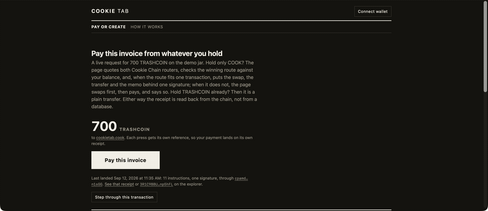

# Cookie Tab

Invoices and tip jars on Cookie Chain that a payer can settle from the token they actually hold.

Fill in a form and you get a short link and a QR code, priced in a token or in dollars. Whoever opens it connects a wallet and pays. A payer holding a different supported token gets Cookiebox and Candy Shop quoted, the better route checked against their own balances, and, when the route and the payment fit one transaction, both signed together. A route too long for that falls back to swapping first and paying second, and says so before anything is signed. An invoice reference goes on chain with the payment, so the jar can say whether that invoice is paid and hand out a receipt page anyone can check against the explorer.

Cookie Tab has no application backend, holds no keys and takes no fee. The payment request travels inside the link, and the history is read back out of the chain. It does depend on things it does not run: the public RPC, the two routers, and the Cookiescan price feed.

Try it. The homepage at https://cookie-tab.pages.dev leads with a live invoice on the demo jar, which owns the CookOven name `cookietab.cook`: 700 TRASHCOIN. A wallet holding only COOK is short of that token, so paying it is the one-transaction path when the route fits, a swap through whichever router quotes better, the transfer and the memo behind one signature; a route too long for that swaps first and pays second, and the page says so. Each press of the button mints its own reference, so the payment lands on its own receipt. Under the button the page shows the last payment that landed there, read from the chain to the same depth as the receipt page: how many instructions, how many signatures, which programs beyond the standard set it went through. Paying needs a funded wallet, so that line also steps through the transaction one instruction at a time, each with its program id and a link to the explorer, for anyone who wants the evidence without spending anything.

- the jar: https://cookie-tab.pages.dev/#/jar/cookietab.cook
- one invoice's receipt, a swap and a payment that landed in a single transaction: https://cookie-tab.pages.dev/#/jar/cookietab.cook?ref=LANDING-COMPOSED

Both resolve the name against the registry on every open, and read the payments from the chain. A receipt also reads each matching transaction's shape back, so a composed checkout shows as its instruction count behind one signature rather than as a claim.



Every frame above is the live site at https://cookie-tab.pages.dev reading Cookie Chain, captured on 2026-09-20.

## Making a request and getting paid

Create a request. Pick a recipient (a Cookie Chain address or a CookOven `.cook` name), a token, and an amount. The amount can be fixed in the token, fixed in US dollars, or left open for a tip jar. Add a label, a note and an invoice reference if you want them.

Share the link. The request is encoded as base64url JSON in the URL fragment after `#/pay/`. A fragment is never sent to a server, so the request does not appear in this app's logs, in a CDN's, or in a referrer header. The same string is also rendered as a QR code.

Get paid. The Pay page decodes the link, resolves the name against the CookOven registry, shows the amount and its dollar value, and builds one transaction. The payer's wallet signs it, and the page sends the signed transaction to the Cookie Chain RPC itself: a wallet asked to send would broadcast it on Solana mainnet, because the wallet-standard adapter maps any RPC host it does not know to mainnet. A payer holding the wrong token can swap first, in the same page, through the Cookie Chain aggregators.

Read the jar. The Jar page lists what arrived, totalled by token, with a link to each transaction on Cookiescan.

Pay from an agent. The link, the memo and the transaction are documented in [docs/wire-format.md](docs/wire-format.md), and the Pay page emits the request as one `transfer` call for an agent on [cookie-mcp](https://github.com/cookiechain/cookie-mcp), memo included. That server's `transfer` takes the memo as of [PR #3](https://github.com/cookiechain/cookie-mcp/pull/3), merged 2026-09-14, so the wire format has an implementation outside this repository. The change is on `main` and not in a release: 0.4.0, the current published version, still drops the memo, and an agent running it pays correctly but leaves no row in a jar.

Settle a reference. A request made with an invoice reference is answered by the same jar narrowed to that reference: `#/jar/<recipient>?ref=<reference>` says whether a payment carrying it has arrived, how much, and in which transaction. The payer gets that link on the paid screen as the receipt; the recipient can hand it to anyone who asks. Opening a referenced link a second time says the reference has already been paid, or part-paid, before the button is offered. Paying again is still allowed, as a choice.

What that page cannot do is prove a negative. A reference is text anyone can put in a memo, so the transaction link is the evidence, not the verdict. The page also sees only what the RPC still holds, roughly ten days. When nothing matches and the read did not cover the jar — it stopped early, or it ran back to the oldest block the node keeps — the page says it has **no record** rather than calling the invoice unpaid, and the Pay page says the same rather than staying silent. Two payers can also both read a reference as unpaid before either transaction takes effect. Nothing here enforces paying once.

## How it works on chain

A payment is one Cookie Chain transaction, and so is a payment with a swap in front of it when the route fits:

- native COOK: a `SystemProgram.transfer`
- an SPL token: a `TransferChecked`, preceded by an idempotent create for the recipient's associated token account. The create rides along on every token payment. It costs nothing when the account is already there, and it names the recipient's wallet among the transaction's account keys, which is what lets their jar find the payment afterwards
- both: an SPL Memo instruction whose text starts with `cookiejar:1`
- optionally, a second transfer of the same token to the Cookie Jar, Cookie Chain's community treasury at `568tU9FMksJDxjkLBjWisSA4J4C5uPH87NCCkyREwrxe`, when the payer ticks the box on the Pay page. One percent of the payment, in the same transaction, under the same memo, so opening that address as a jar here lists the gift alongside everything else it has received. The Cookie Jar project has not integrated anything; this is Cookie Tab reading a public address. Off unless the payer turns it on; the destination and the amount are shown before anything is signed. The treasury is a plain system-owned wallet, which a live check confirms, so it is paid the way any recipient is

The memo is what makes a jar readable. A jar is more than one address. Native COOK arrives on the wallet, an SPL transfer arrives on a token account the wallet owns, and the two index separately, so `Jar` lists the recipient's wallet plus every token account under it, calls `getSignaturesForAddress` on each, merges the results into one list in block order, fetches each transaction, keeps the ones whose memo starts with the prefix, and takes the amount from the transaction's own `preBalances`/`postBalances` and `preTokenBalances`/`postTokenBalances`. No indexer and no database are involved: any Solana RPC client pointed at Cookie Chain can rebuild the same list, within what that node still holds. A public Cookie Chain node keeps roughly the last ten days of signatures, so a jar reads back that far and no further. Where a reference cannot be found and the read did not reach the end of the jar's history, the receipt page says it has no record rather than calling the invoice unpaid.

A `.cook` name is read straight from the CookOven registry program. `resolveRecipient` derives the `["domain", label]` program address, reads the account, and decodes the owner. A name that is listed for sale on the `.cook` marketplace is refused rather than resolved. The registry then points it at the marketplace escrow, which is program-owned and has no signer, so paying it would send the money somewhere nobody can spend it.

A dollar-quoted request is converted at the Cookiescan price when the payer opens the link, in the browser, and the token amount is shown before they sign. Nothing is pegged and nothing is escrowed. The conversion is fixed-point BigInt arithmetic throughout, because a COOK amount that fits an ordinary invoice already exceeds what a double holds at 9 decimals.

The swap step asks both Cookie Chain aggregators for a route and keeps the larger output. Whichever one won then builds it (Cookiebox through `POST /swap-tx`, Candy Shop through `POST /swap-tx/multi-route`) and returns an unsigned versioned transaction whose fee payer is the payer's own wallet. Cookie Tab simulates it, the wallet signs it, and this page sends it. The funds never pass through the app.

When the swap's output covers the payment, the two go to the wallet as one transaction. The router's transaction is checked on its own first (`verifySwapTransaction`: the payer is the only signer and the fee payer, it simulates, and the payer's balances move as quoted and nowhere else); then its message is taken apart, the payment's instructions — transfer, token-account create, memo — are put on the end, the whole thing is recompiled as one v0 message paid for by the payer and simulated together, and the recipient's balance in that simulation has to move by exactly the payment. One signature; the swap and the payment land together or neither does. A transaction has a hard size limit (1,232 bytes), and a two-hop route with the payment behind it can pass it: then the offer is withdrawn and the swap goes first as its own transaction, with the payment after it, so a payer can stop after either one.

Cookie Tab does not hold keys, does not take a fee, and does not deploy a program of its own.

## Addresses and endpoints

| What | Address or host |
| --- | --- |
| RPC | `https://rpc.cookiescan.io` |
| Websocket | `wss://wss.cookiescan.io` |
| Native COOK (wrapped mint) | `So11111111111111111111111111111111111111112` |
| SPL Memo v2 | `MemoSq4gqABAXKb96qnH8TysNcWxMyWCqXgDLGmfcHr` |
| CookOven `.cook` registry | `H43Qtq4AMQ86y7yc3YtCKZJ2QMhhnCcHyZKeFeoQn7PA` |
| CookOven `.cook` marketplace | `Ey35mr69UfiQqZSwD2qYAZoMNfnuVJGCjwNSB64ppHm7` |
| Prices, tokens, DAS | `https://api.cookiescan.io` |
| Cookiebox aggregator | `https://agg.cookiebox.app` |
| Candy Shop aggregator | `https://swap.cookiescan.io/api` |
| Explorer | `https://cookiescan.io` |
| COOK bridge from Solana | `https://bridge.cookiescan.io` |

Cookie Tab deploys no program and owns no address. It reads and writes only through the programs above.

## Setup

Node 22 or later is required.

```
npm install
npm run dev
```

The dev server prints a local URL. Open it, connect a wallet, and make a link.

```
npm run build      # typecheck, then a static bundle in dist/
npm run preview    # serve dist/ locally
npm test           # 150 unit and render tests, no network
npm run live       # 28 checks against the live chain, no key, no funds
npm run lint
```

## Environment variables

Every one is optional. The defaults are the public Cookie Chain endpoints, and the app runs with no `.env` file at all.

| Variable | Default |
| --- | --- |
| `VITE_COOKIE_RPC_URL` | `https://rpc.cookiescan.io` |
| `VITE_COOKIE_WS_URL` | `wss://wss.cookiescan.io` |
| `VITE_COOKIESCAN_API_URL` | `https://api.cookiescan.io` |
| `VITE_COOKIEBOX_AGG_URL` | `https://agg.cookiebox.app` |
| `VITE_CANDYSHOP_API_URL` | `https://swap.cookiescan.io/api` |
| `VITE_COOKIE_EXPLORER_URL` | `https://cookiescan.io` |
| `VITE_REPO_URL` | this repository |

Set a private RPC through `VITE_COOKIE_RPC_URL` if the public one rate-limits you. No variable holds a secret. The app never sees a key.

## Deploying

The build is a directory of static files. Routing is in the URL fragment, so any file host serves it as it stands, with no rewrite rules and no environment secrets.

On Cloudflare Pages:

- build command: `npm run build`
- build output directory: `dist`
- Node version: 22 or later

Any other static host works the same way. Upload `dist/`.

## The live checks

`npm run live` runs 28 checks against Cookie Chain and the ecosystem APIs. They are read-and-simulate checks: nothing is signed and nothing is sent, so they run without a key and without funds, and they cannot prove that a payment lands — [the funded test](#the-funded-end-to-end-test) below does that. They cover the link round-trip, `.cook` resolution for a registered and an unregistered name and for the demo jar's own name, the dollar quote, the token registry, a COOK transfer, an SPL transfer, both aggregators quoted and built in both directions, a swap composed with a payment on each router, the Cookie Jar round-up, and the jar history read, including one known payment into the demo jar, read back from the chain with its amount and its reference for as long as the retention window holds it.

The homepage invoice and the evidence under it are covered too: its token's decimals against the registry; the last composed checkout landed under its reference, read back as one signature; a jar read's own report of whether it ran into the retention floor, against `getFirstAvailableBlock` and the oldest signature the node will return; and the scheduled refresh job against the app's own constants, since a reference that stops being re-landed silently stops being readable.

The transfer checks run twice over. Once as a real holder with signature verification off, which proves the transaction is valid end to end. Once as a freshly generated keypair, which must fail with `AccountNotFound` and nothing else. An address that has never held COOK has no account on chain, so that error is the whole of what is wrong, and it proves the rest of the transaction is well formed.

## The funded end-to-end test

The checks above never move money. To confirm a real payment, one funded wallet is needed.

1. Bridge a small amount of COOK from Solana at `https://bridge.cookiescan.io`. A payment costs 0.000005 COOK in fees, so a dollar of COOK covers thousands of them; the amount to bridge is set by what you want to send, not by the fee.
2. Open the app, connect that wallet, and make a link paying a second address a small amount of COOK.
3. Open the link in another browser or another profile, connect the funded wallet, and pay.
4. Read the signature on the receipt against `https://cookiescan.io/tx/<signature>`, and confirm the transaction contains an SPL Memo instruction whose text starts with `cookiejar:1`.
5. Open the jar page for the recipient. The payment must appear with the right amount, note and reference.

Step 5 is the one that matters. It proves the history is rebuilt from chain data with nothing stored anywhere.

## Paying from an agent, end to end

The same invoice can be settled by an agent instead of a browser, which puts the wire format inside software this repository does not control. The agent needs a wallet of its own and the cookie-mcp build that carries the memo parameter.

`scripts/fund-agent-wallet.ts` prepares that wallet. It buys TRASHCOIN with the bounty payer's COOK if the payer does not already hold enough, then sends the agent a little over one invoice plus the COOK for fees and its token account. `--dry-run` quotes the swap and simulates the transfer without sending either. A wallet holding one invoice cannot pay two, so the balance bounds what a misfired tool call can spend.

Point an MCP client at a cookie-mcp whose `transfer` takes `memo`, give it the pay link, and ask it to pay. The agent decodes the request, pays the amount in the token the request names, and writes `cookiejar:1|<ref>|<note>` into the memo. That reference then answers on the receipt page like any other payment, with the payer's own address in the From column. An agent running the published 0.4.0 moves the money without writing a memo, so its payment does not appear in a jar.

The demonstration under `AGENT-DEMO` was sent by `scripts/agent-pay.ts` rather than by an assistant, and the distinction is worth keeping straight. Claude Code's permission classifier refuses an outbound payment from any session under its real-world-transactions rule, so a run that decoded the request, resolved the name and checked the mint's decimals was still denied at the `transfer` call. The script builds the same three instructions and sends them from the same wallet. What the landed payment shows is a payment the recipient did not make, reconciled from its memo alone; it does not show an assistant deciding to pay, and this repository does not claim that.

## Known limits

What the swap check does and does not establish. Before a router's transaction reaches a wallet, Cookie Tab requires that the payer is the fee payer and the only signature it needs, that it simulates without error, and that in simulation the payer's own balances move the way the quote said: at least the minimum out arrives, no more of the sold token leaves than was quoted, and nothing else the wallet holds goes down. That is a check against this quote, not a security review of the router. It does not enumerate the instructions or hold them to an allowlist, so a route that satisfies every one of those conditions is accepted whatever programs it calls. The composed form adds one more requirement: in simulation the recipient's balance moves by exactly the invoice. A quote can still move between simulation and the transaction taking effect. The router's own minimum-out is what bounds that, not this app.

An invoice is not enforced to be paid once. Two payers can each read a reference as unpaid before either transaction lands, and both will settle. The warning on a second open is a courtesy, not a lock.

A jar sees only as far back as its RPC retains. `getSignaturesForAddress` can answer only for blocks the node still holds, and the public Cookie Chain endpoint keeps a rolling window: measured on 2026-09-14, `getFirstAvailableBlock` was 22,930,184 against slot 25,096,443, which is 2,166,259 slots, or roughly ten days. Payments older than the window are on chain but not in the index, and no client can list them from that endpoint. `npm run live` prints the current figure. An archival RPC set through `VITE_COOKIE_RPC_URL` sees further.

Reading every signature a node returns is not the same as reading a jar's whole life, and the settlement states follow that rule rather than the appearance of a complete read. A jar older than the window ends its history at the node's earliest block, not at its own first payment, so an invoice settled before that looks exactly like one never paid. A read whose oldest signature lands within 216,000 slots of `getFirstAvailableBlock`, about a day, is treated as having run into the floor: it can still report an invoice **paid**, because a match is evidence wherever it is found, but it cannot report one **unpaid**. It says **no record** instead. The same applies when the scan stops at its own cap or payment limit, and when the node will not say how far back it goes.

Within the window, a jar pages back through the signatures of its wallet and of the token accounts it owns, a page at a time from each in turn, until it has 50 Cookie Tab payments or has read 1,000 signatures across all of those addresses. The page says which of the two stopped it: it shows the latest 50 when more payments remain to be read, and names the 1,000-signature cap when that ran out first. At most 30 token accounts are read alongside the wallet, the ones holding a balance first, because a wallet can carry hundreds of empty accounts left behind by airdrops and each one costs a request.

A transfer to a jar's address without a Cookie Tab memo is left out. A jar lists Cookie Tab payments. Read the address on Cookiescan for a full account statement.

A jar row records what the chain recorded, and nothing more. Anyone can send a jar a small amount with a memo that starts with `cookiejar:1` and a note of their choosing, and it appears in the history like any other payment. Every row links to its transaction on Cookiescan. Check the amount and the sender there before treating a row as a settled invoice.

The swap step seeds its input amount from the two Cookiescan prices plus 3% headroom, because both aggregators quote exact-in rather than exact-out. The quote below the field is what the router actually offers, and the payer can change the number and re-quote.

`npm audit` reports advisories in the Solana dependency tree, all of them on Node-only or mobile-only paths that the browser bundle never loads. The one that reaches the bundle, `bigint-buffer` under `@solana/spl-token`, concerns a native Node addon; a browser runs the package's plain JavaScript instead and no patched version exists at any release.

## Licence

MIT.
